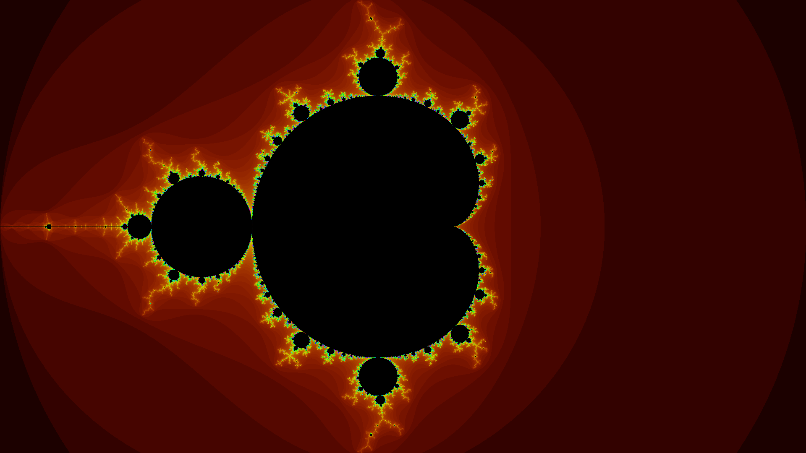

# Distributed Mandelbrot set
## Author
Andrea Sanchez Blanco

## Description
Project for Concurrent and Distribution course at University of Vigo where we implemented in Java a client-server architecture to calculate the Mandelbrot set.

[Doxygen documentation](doxygen/html/index.html)

Output image:
